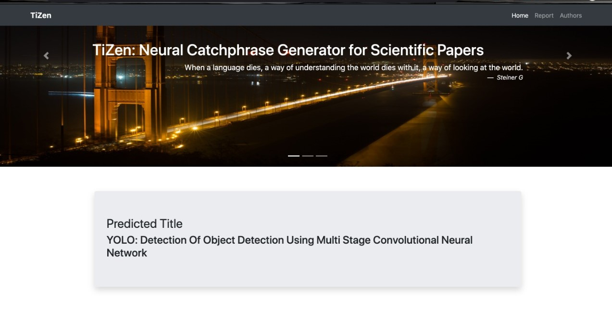
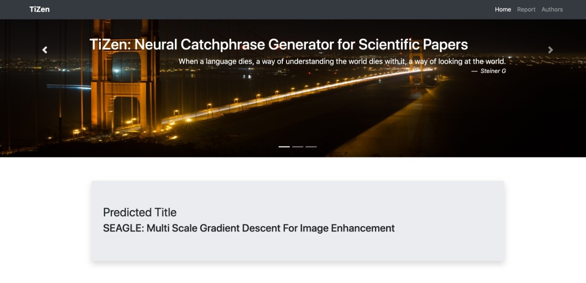
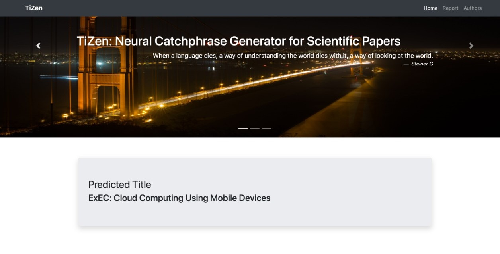
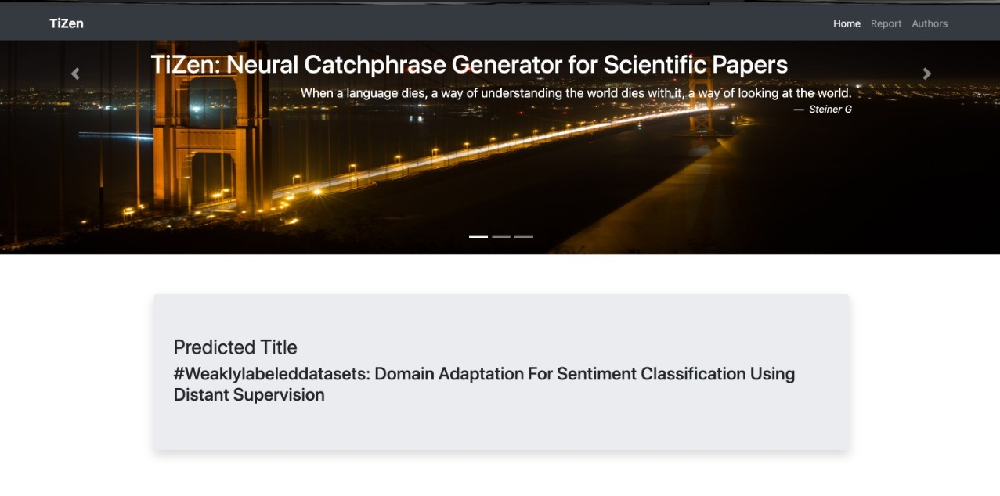
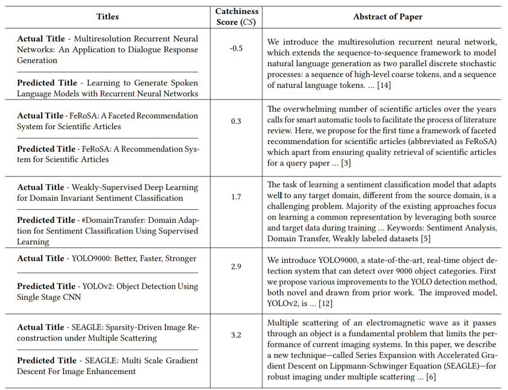

# Neural Title Generation for Scientific Papers

This repository contains all code for the paper TiZen: Neural Title Generation for Scientific Papers

# Images of TiZen Dashboard:

## Example 1

Actual Title - You Only Look Once: Unified, Real-Time Object Detection

## Example 2

Actual Title - SEAGLE: Sparsity-Driven Image Reconstruction under Multiple Scattering

## Example 3

Actual Title - ExEC: Elastic Extensible Edge Cloud 

## Example 4

Actual Title - Weakly-Supervised Deep Learning for Domain Invariant Sentiment Classification 

# Table showing comparison of actual titles and titles generated by TiZen along with Catchiness Scores

A comparison of actual and predicted titles by TiZen is illustrated in the table below:

